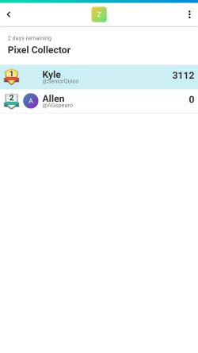
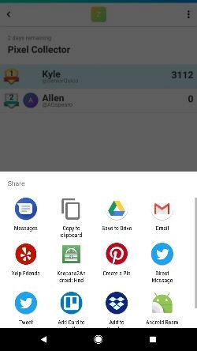
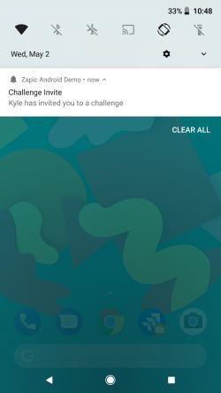

# Zapic SDK for Android

  

Copyright (c) 2017-2018 Zapic, Inc.

The Zapic SDK for Android is an open-source project that allows game developers to integrate with the Zapic platform from a game written in Kotlin or Java for Android.

_Android, Kotlin, Google Play, and the Google Play logo are trademarks of Google LLC._

_Oracle and Java are registered trademarks of Oracle and/or its affiliates._

## Getting Started

Learn more about integrating the SDK and configuring your Android game in the Zapic platform at https://www.zapic.com/docs/android.

## Community

Ask questions on [Stack Overflow](https://stackoverflow.com/questions/ask?tags=zapic). Be sure to include the `zapic` tag with your question.

Chat on [Discord](https://discord.gg/uC3k5D7).

Follow [@ZapicInc](https://twitter.com/ZapicInc) on Twitter for important announcements.

Report bugs and discuss new features on [GitHub](https://github.com/ZapicInc/Zapic-SDK-Android/issues).

## Contributing

We accept contributions to the Zapic SDK for Android. Simply fork the repository and submit a pull request on [GitHub](https://github.com/ZapicInc/Zapic-SDK-Android/pulls).

## Quick Links

* [Zapic Documentation](https://www.zapic.com/docs)
* [Zapic SDK for Unity](https://github.com/ZapicInc/Zapic-SDK-Unity)
* [Zapic SDK for iOS](https://github.com/ZapicInc/Zapic-SDK-iOS)

# Zapic Android Demo

This project includes a [Zapic Android demo game](zapic-demo) configured with the Zapic SDK for Android. Zapic is initialized with the demo game by attaching a fragment to the main activity during the `onCreate` lifecycle event. See [line 124 in MainActivity.java](zapic-demo/src/main/java/com/zapic/androiddemo/MainActivity.java#L124).

The demo game is very simple. The activity counts the number of pixels as a player drags their finger across the background image. After the player drags their finger, the activity submits a gameplay event with a `DISTANCE` parameter that includes the total number of pixels. See [lines 243-244 in MainActivity.java](zapic-demo/src/main/java/com/zapic/androiddemo/MainActivity.java#L243-L244).

The activity includes a Zapic branded button (required by the [Terms of Use](https://www.zapic.com/terms/)) that opens Zapic and shows the default page. See [line 103 in MainActivity.java](zapic-demo/src/main/java/com/zapic/androiddemo/MainActivity.java#L103).

The activity also includes a "Challenges" button that explicitly opens the challenges page for the current game. See [line 111 in MainActivity.java](zapic-demo/src/main/java/com/zapic/androiddemo/MainActivity.java#L111).

*Try it out! Get it on Google Play, make a friend on Zapic, and challenge your friend to collect the most number of pixels!*

 

## Deep Links

The demo game has been configured to use the [Branch](https://branch.io/) third-party integration to provide deep links.

The deep links feature allows a player to share very specific content with friends, such as challenge invitations. The game is automatically launched when another player opens the deep link. The deep links feature also redirects players to the Play Store to download the game if it is not already installed.

The Branch SDK has been configured to relay deep links to Zapic. If a deep link references actionable Zapic content, such as a challenge invitiation, then the Zapic activity automatically launches with a specially tailored user interface. If a deep link does not reference actionable Zapic content, it is simply ignored. See [lines 206-208 in MainActivity.java](zapic-demo/src/main/java/com/zapic/androiddemo/MainActivity.java#L206-L208).

The Zapic SDK has also been configured to relay the unique user identifier to Branch. This enables user attribution within the Branch dashboard. See [lines 39-57 in MainApplication.java](zapic-demo/src/main/java/com/zapic/androiddemo/MainApplication.java#L39-L57).

*Try it out! Open the link below on an Android device! The challenges page opens if the game is already installed. The Play Store opens if the game is not already installed.*

[**Open the Zapic Android Demo (only configured to work on an Android device)**](https://6k50.app.link/DLH7j8jpeM)

*Try it out! Ask a friend to to challenge you and to share the unique challenge link via SMS, Twitter, etc.!*

 

## Push Notifications

The demo game has been configured to use the [OneSignal](https://onesignal.com) third-party integration to provide push notifications.

The push notifications feature allows players to receive notifications as important events occur, such as challenge invitations, and to receive notifications that encourage re-engagement after a period of inactivity.

The OneSignal SDK has been configured to relay push notifications to Zapic. If a push notification references actionable Zapic content, such as a challenge invitiation, then the Zapic activity automatically launches with a specially tailored user interface. If a push notification does not reference actionable Zapic content, it is simply ignored. See [lines 29-32 in MainActivity.java](zapic-demo/src/main/java/com/zapic/androiddemo/MainApplication.java#L29-L32).

The Zapic SDK has also been configured to relay the user's unique push notification token to OneSignal. Zapic uses the unique push notification token, *not the user identifier*, to when sending content to users. This helps prevent users from impersonating one another (refer to the [OneSignal documentation](https://documentation.onesignal.com/docs/identity-verification) for more context). See [lines 39-57 in MainApplication.java](zapic-demo/src/main/java/com/zapic/androiddemo/MainApplication.java#L39-L57).

*Try it out! Ask a friend to challenge you! The push notification should be delivered shortly after the challenge has been created.*

 
